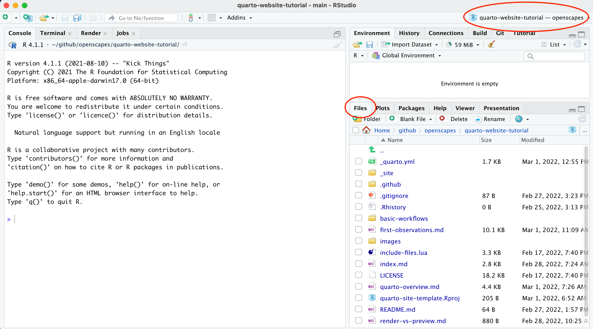
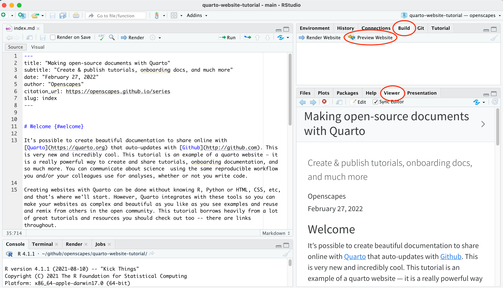

The RStudio software (called an IDE, integrated development environment) is an excellent way to edit files and interface with GitHub. Plus, as it is made by the same folks who make Quarto, it has many integrated features for streamlining your workflow with Quarto, including how it previews your edits and provides debugging support for yaml! Here is what you'll need to do to set up and use RStudio.

## Setup RStudio and GitHub

### Installation

For a workflow with RStudio and GitHub on your local computer, you will need four things:

1.  R
2.  RStudio
3.  Git
4.  GitHub

Follow the [UCSB MEDS Installation Guide](https://ucsb-meds.github.io/meds-install-guide.html) for detailed instructions on how to create accounts, download, install, and configure on Mac and Windows. This takes about 20 minutes. (For an even more detailed walk-through, see [Allison Horst's ESM 206 Google Doc](https://docs.google.com/document/d/1zx2upJJqFZe94O3BQSMI56Z76s3haLXC0otKSpcZaJQ/edit)). Thanks for sharing Allison!

### Clone your repo

You'll start by cloning your repository into RStudio.

File \> New Project \> Version Control \> Git \> paste your repository name.

[R for Excel Users: Clone your repository using RStudio](https://rstudio-conf-2020.github.io/r-for-excel/github.html#clone-your-repository-using-rstudio) has detailed instructions and screenshots of these steps.

## Install Quarto

Next, you'll install Quarto. Download Quarto from <https://quarto.org/docs/get-started/>. Follow the installation wizard on your computer. When it is complete, you won't see an application or any new software, but it is now available to RStudio (as well as other applications, including the command line).

## RStudio orientation

Now let's take a moment to get oriented. This is an RStudio project, which is indicated in the top-left. The bottom right pane shows all the files in your project; everything we've cloned from GitHub.

{fig-alt="Screenshot of the RStudio IDE highlighting the project name and files pane" fig-align="center"}

Click on `index.md`. This will open in a fourth pane; the editor pane. In the upper left, click on the Build tab \> Preview Website, and we'll see a preview of our website show up in the Viewer pane at the bottom right. (This is the default, you can also have it open as a separate html document).

{fig-alt="Screenshot of RStudio IDE with a file open in the editor, and highlighting the Build and Viewer panes" fig-align="center"}

### Visual Editor

-   Visual editor makes a familiar experience

-   copy-paste formatting from Google Doc

## Quarto preview (?)

## Create a new `.Rmd` page

Example:

load packages and data

explore

tidy

plot

## Update `_quarto.yml`

## Quarto render

## Render on Save

## Authoring
